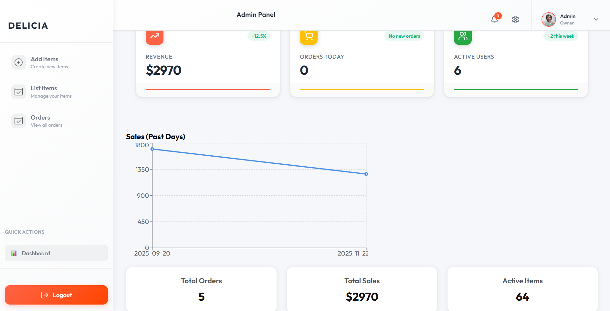

Delicia
# 🍽️ Delicia — Production-Ready Full‑Stack Food Ordering Platform

Delicia is a **production-oriented full-stack food ordering web application** built using the **MERN stack**. The project demonstrates strong fundamentals in **frontend engineering**, **backend API design**, **database modeling**, and **real-world application structuring**, making it well-suited for **resume shortlisting, internships, and placements**.

---

## 🚀 Project Overview

* End-to-end food ordering system with **user-facing app** and **admin dashboard**
* Clean separation of **frontend, backend, and admin panel**
* Scalable REST API architecture
* Localization-ready pricing system (**₹ INR support**)

---

## 🖼️ Application Screenshots

### Home Page


### Food Listing & Categories


### Cart & Price Calculation


### Admin Dashboard



> 📌 Screenshots are stored in the `screenshots/` directory at the root level.

---

## ✨ Key Features

### User Module

* Browse food items with category-based listing
* Add/remove items from cart
* Dynamic cart total calculation
* Localized currency formatting (₹ INR)
* Responsive UI for multiple screen sizes

### AI Chatbot Assistant

* Integrated **Delicia Assistant** chatbot for user support
* Handles common queries like menu, pricing, ordering steps, and recommendations
* Quick-action buttons for faster user interaction
* Always-available floating chat widget enhancing UX

### Subscription System

* Email subscription feature for offers and updates
* User-friendly subscribe input in footer section
* Foundation ready for newsletter / marketing automation integration

### Admin Module

* Secure admin dashboard
* Add, update, and delete food items
* Image upload for products
* Centralized menu management

### Engineering Highlights

* Modular React component architecture
* RESTful API design using Express
* MongoDB schema modeling with Mongoose
* Separation of concerns across services
* Ready for deployment and scaling

---

## 🧰 Tech Stack

**Frontend**

* React.js
* JavaScript (ES6+)
* CSS / Tailwind CSS
* Axios

**Backend**

* Node.js
* Express.js
* MongoDB
* Mongoose

**Tools & Practices**

* Git & GitHub (version control)
* VS Code
* Postman (API testing)

---

## 📁 Repository Structure

```
Delicia/
├── frontend/        # User-facing React application
├── admin/           # Admin dashboard
├── backend/         # Node.js + Express REST API
├── screenshots/     # UI screenshots
└── README.md
```

---

## ⚙️ Local Setup Instructions

### 1️⃣ Clone Repository

```bash
git clone https://github.com/Vikaumar/Delicia.git
cd Delicia
```

### 2️⃣ Backend Setup

```bash
cd backend
npm install
npm run dev
```

Create a `.env` file inside `backend/`:

```env
MONGO_URI=your_mongodb_connection_string
PORT=5000
```

### 3️⃣ Frontend Setup

```bash
cd frontend
npm install
npm start
```

### 4️⃣ Admin Panel Setup

```bash
cd admin
npm install
npm start
```

---

## 💱 Currency Localization

* Prices are handled in **Indian Rupees (₹ INR)**
* Implemented using `Intl.NumberFormat("en-IN")` for accurate formatting
* Architecture supports future multi-currency extension

---

## 🎯 Learning & Outcomes

* Built a complete MERN-stack application from scratch
* Designed REST APIs and database schemas
* Implemented admin-level CRUD operations
* Applied clean code principles and modular design
* Gained experience with real-world project structuring

---

## 🚧 Future Enhancements

* User authentication & authorization (JWT)
* Online payments (Razorpay integration)
* Order tracking & history
* Search, filters, and pagination
* Cloud deployment (AWS / Render / Vercel)

---

## 📜 License

This project is licensed under the **MIT License**.

---

## 👨‍💻 Author

**Vikas Kumar**
🎓 B.Tech CSE, IIIT Kota (3rd Year)
💼 Aspiring Full‑Stack Engineer
🔗 GitHub: [https://github.com/Vikaumar](https://github.com/Vikaumar)

---

⭐ *This project is actively maintained and open to contributions.*
